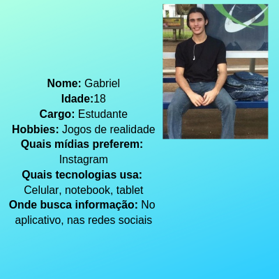

# Data Lovers - Pokémon
Dupla: *Daiana Lugo Carvalho & Yara Guimarães de Oliveira*

[Link da aplicação](https://daianalugocarvalho.github.io/data-lovers/)

Segundo projeto desenvolvido no curso de Desenvolvedoras Front-End para o Bootcamp **Laboratória** - campus SP - Brasil.

## Índice

* [Organização](#Organização)
* [Checklist](#Checklist)
* [Personas](#Personas)
* [Definição do produto](#Definição-do-produto)
* [Protótipo](#Protótipo)
* [Testes de usabilidade](#Testes-de-usabilidade)

## Organização

No primeiro sprint foi utilizado a ferramenta **Trello**.

Em ambas situações, dividimos o projeto em mini partes e as mesmas foram divididas entre as integrantes da dupla. Foram priorizadas utilizando 2 critérios principais: o que era necessário para formar o _esqueleto_ do site e o que "nós" como desenvolvedoras tínhamos mais facilidade em programar, deixando o que demandaria mais tempo de aprendizagem e de desenvolvimento por último. Todos os itens possuiam data definida para o término.

[Trello Data Lovers](https://trello.com/invite/b/qJ3Bf00s/8a48912b62a88909ed1dbd86afe2aa93/data-lovers)

## Checklist

* [X] Usar VanillaJS.
* [X] Inclui _Definição de produto_ clara e informativa no `README.md`.
* [X] Inclui esboço da solução (protótipo de baixa fidelidade e de alta fidelidade, se houver) no
  `README.md`.
* [X] Inclui a lista de problema detectados através dos testes de usabilidade
  no `README.md`.
* [ ] UI: Mostra lista e/ou tabela com dados e/ou indicadores.
* [X] UI: Permite ordenar os dados por meio de um ou mais campos
  (asc e desc).
* [X] UI: Permite filtrar os dados com base em uma condição.

## Personas

## Definição do produto

**Pokelab** é um site focado nos jogadores do Pokémon GO, onde possibilita buscas por ordem alfabética e por tipo.

O objetivo da aplicação é oferecer uma interface intuitiva e divertida que proporcione ao usuário uma ferramenta de pesquisa e consulta e traga informações relevantes sobre os Pokémons.

## Protótipo
[Link do 1º Protótipo - Marvel](https://marvelapp.com/b2cg16h)
[Link do 2º Protótipo - Marvel](https://marvelapp.com/b2cg16h)

## Testes de Usabilidade
Problemas detectados no teste de usabilidade:
* Necessita melhoria na responsividade
* Ao selectionar um tipo específico e uma ordenação, nem sempre os filtros estão acumulando as duas seleções para apresentar o resultado esperado.

Observações extras: não conseguimos fazer o hacker edition.

